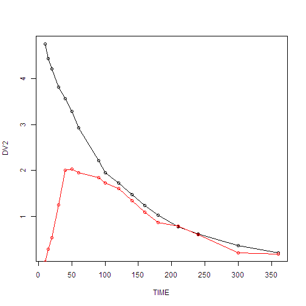
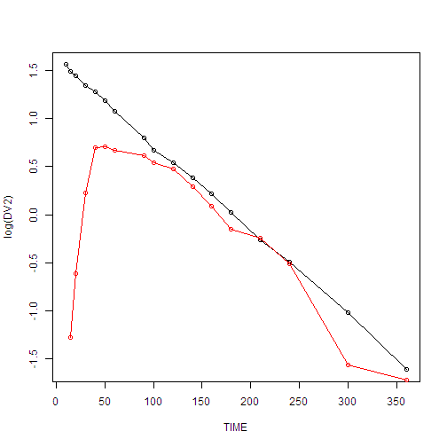

# PK2- One-compartment oral dosing

이 예제는 Pharmacokinetic and Pharmacodynamic Data Analysis 교과서의 예제입니다.  
소스 코드는 [깃헙](https://github.com/asancpt/edison-gab)에 올라와 있습니다.
에디슨 앱은 <https://www.edison.re.kr/simulation> 에서 확인할 수 있습니다.


```r
PK02 = read.csv("data-raw/PK02.csv", skip=1)
colnames(PK02) = c("TIME","DV")
DV2 = c(4.75, 4.43, 4.21, 3.81, 3.57, 3.28, 2.93, 2.21, 1.95, 1.72, 1.47 ,1.24, 1.02, 0.77, 0.61, 0.36, 0.2)
PK02 = cbind(PK02, DV2)
PK02
```

```
##    TIME   DV  DV2
## 1    10 0.00 4.75
## 2    15 0.28 4.43
## 3    20 0.54 4.21
## 4    30 1.25 3.81
## 5    40 2.00 3.57
## 6    50 2.03 3.28
## 7    60 1.95 2.93
## 8    90 1.85 2.21
## 9   100 1.72 1.95
## 10  120 1.60 1.72
## 11  140 1.34 1.47
## 12  160 1.09 1.24
## 13  180 0.86 1.02
## 14  210 0.78 0.77
## 15  240 0.60 0.61
## 16  300 0.21 0.36
## 17  360 0.18 0.20
```

```r
dPK02 = PK02
require(wnl)

## Plot
plot(DV2 ~ TIME, data=PK02, type="o")
lines(DV ~ TIME, data=PK02, type="o", col="red")
```



```r
plot(log(DV2) ~ TIME, data=PK02, type="o")
lines(log(DV) ~ TIME, data=PK02, type="o", col="red")
```



```r
## NCA
library(NonCompart)
R1 = sNCA(PK02$TIME, PK02$DV2, dose=100, adm="Bolus", doseUnit="ug", timeUnit="min") ; R1
```

```
##            b0          CMAX         CMAXD          TMAX          TLAG 
##  1.616931e+00  4.750000e+00  4.750000e-02  1.000000e+01            NA 
##          CLST         CLSTP          TLST        LAMZHL          LAMZ 
##  2.000000e-01  2.051590e-01  3.600000e+02  7.795712e+01  8.891391e-03 
##        LAMZLL        LAMZUL       LAMZNPT        CORRXY            R2 
##  1.000000e+01  3.600000e+02  1.700000e+01 -9.996938e-01  9.993877e-01 
##         R2ADJ        AUCLST        AUCALL        AUCIFO       AUCIFOD 
##  9.993469e-01  5.475551e+02  5.475551e+02  5.700487e+02  5.700487e+00 
##        AUCIFP       AUCIFPD        AUCPEO        AUCPEP       AUMCLST 
##  5.706290e+02  5.706290e+00  3.945920e+00  4.043590e+00  5.283100e+04 
##       AUMCIFO       AUMCIFP       AUMCPEO       AUMCPEP            C0 
##  6.345855e+04  6.373269e+04  1.674723e+01  1.710533e+01  5.461015e+00 
##       AUCPBEO       AUCPBEP           VZO           VZP           CLO 
##  8.956265e+00  8.947158e+00  1.972960e+01  1.970954e+01  1.754236e-01 
##           CLP      MRTIVLST      MRTIVIFO      MRTIVIFP          VSSO 
##  1.752452e-01  9.648527e+01  1.113213e+02  1.116885e+02  1.952838e+01 
##          VSSP 
##  1.957287e+01 
## attr(,"units")
##  [1] ""            "ug/L"        "ug/L/ug"     "min"         "min"        
##  [6] "ug/L"        "ug/L"        "min"         "min"         "/min"       
## [11] "min"         "min"         ""            ""            ""           
## [16] ""            "min*ug/L"    "min*ug/L"    "min*ug/L"    "min*ug/L/ug"
## [21] "min*ug/L"    "min*ug/L/ug" "%"           "%"           "min2*ug/L"  
## [26] "min2*ug/L"   "min2*ug/L"   "%"           "%"           "ug/L"       
## [31] "%"           "%"           "L"           "L"           "L/min"      
## [36] "L/min"       "min"         "min"         "min"         "L"          
## [41] "L"          
## attr(,"UsedPoints")
##  [1]  1  2  3  4  5  6  7  8  9 10 11 12 13 14 15 16 17
```

```r
R2 = sNCA(PK02$TIME, PK02$DV, dose=100, adm="Extravascular", doseUnit="ug", timeUnit="min") ; R2
```

```
##            b0          CMAX         CMAXD          TMAX          TLAG 
##  1.543456e+00  2.030000e+00  2.030000e-02  5.000000e+01  1.000000e+01 
##          CLST         CLSTP          TLST        LAMZHL          LAMZ 
##  1.800000e-01  1.663124e-01  3.600000e+02  7.476994e+01  9.270399e-03 
##        LAMZLL        LAMZUL       LAMZNPT        CORRXY            R2 
##  9.000000e+01  3.600000e+02  1.000000e+01 -9.852075e-01  9.706337e-01 
##         R2ADJ        AUCLST        AUCALL        AUCIFO       AUCIFOD 
##  9.669630e-01  3.305500e+02  3.305500e+02  3.499666e+02  3.499666e+00 
##        AUCIFP       AUCIFPD        AUCPEO        AUCPEP       AUMCLST 
##  3.484902e+02  3.484902e+00  5.548140e+00  5.147966e+00  4.261000e+04 
##       AUMCIFO       AUMCIFP       AUMCPEO       AUMCPEP          VZFO 
##  5.169447e+04  5.100366e+04  1.757338e+01  1.645698e+01  3.082300e+01 
##          VZFP          CLFO          CLFP      MRTEVLST      MRTEVIFO 
##  3.095359e+01  2.857415e-01  2.869522e-01  1.289064e+02  1.477126e+02 
##      MRTEVIFP 
##  1.463561e+02 
## attr(,"units")
##  [1] ""            "ug/L"        "ug/L/ug"     "min"         "min"        
##  [6] "ug/L"        "ug/L"        "min"         "min"         "/min"       
## [11] "min"         "min"         ""            ""            ""           
## [16] ""            "min*ug/L"    "min*ug/L"    "min*ug/L"    "min*ug/L/ug"
## [21] "min*ug/L"    "min*ug/L/ug" "%"           "%"           "min2*ug/L"  
## [26] "min2*ug/L"   "min2*ug/L"   "%"           "%"           "L"          
## [31] "L"           "L/min"       "L/min"       "min"         "min"        
## [36] "min"        
## attr(,"UsedPoints")
##  [1]  8  9 10 11 12 13 14 15 16 17
```

```r
BA = R2["AUCIFO"]/R1["AUCIFO"]; BA * 100 # Absolute Bioavailability (BA)
```

```
##   AUCIFO 
## 61.39241
```

```r
## Model without tlag
Dose = 100

fPK01 = function(THETA) # Prediction function
{
  DOSE = Dose
  TIME = e$DATA[,"TIME"]

  BA   = BA
  K    = THETA[1]
  Ka   = THETA[2]
  V    = THETA[3]

  F  = BA*DOSE/V*Ka/(Ka - K) * (exp(-K*TIME) - exp(-Ka*TIME))
  H1 = 1

  return(cbind(F, H1))
}

nlr(fPK01, dPK02, pNames=c("k", "Ka", "V"), IE=c(0.05, 0.1, 30))
```

```
## $Est
##                k           Ka         V   AddErrVar    AddErrSD
## PE   0.013698916  0.013699384 12.512458  0.27325141  0.52273455
## SE   0.009900321  0.009900641  8.994196  0.06627321  0.06339088
## RSE 72.270834504 72.270699963 71.881932 24.25356542 12.12678271
## 
## $Cov
##                       k            Ka             V     AddErrVar
## k          9.801636e-05 -9.172333e-05 -8.727111e-02 -3.783325e-09
## Ka        -9.172333e-05  9.802268e-05  8.603379e-02  3.734622e-09
## V         -8.727111e-02  8.603379e-02  8.089557e+01  3.532174e-06
## AddErrVar -3.783325e-09  3.734622e-09  3.532174e-06  4.392138e-03
## 
## $run
## $run$m
## [1] 16
## 
## $run$n
## [1] 18
## 
## $run$run
## [1] 7
## 
## $run$p.value
## [1] 7.541375e-05
## 
## 
## $`Objective Function Value`
## [1] -10.11035
## 
## $`-2LL`
## [1] 21.13356
## 
## $AIC
## [1] 29.13356
## 
## $AICc
## [1] 32.4669
## 
## $BIC
## [1] 32.46642
## 
## $Convergence
## NULL
## 
## $Message
## [1] "CONVERGENCE: REL_REDUCTION_OF_F <= FACTR*EPSMCH"
## 
## $Prediction
##               F H1
##  [1,] 0.5861090  1
##  [2,] 0.8209607  1
##  [3,] 1.0221479  1
##  [4,] 1.3369352  1
##  [5,] 1.5543702  1
##  [6,] 1.6942200  1
##  [7,] 1.7727864  1
##  [8,] 1.7630462  1
##  [9,] 1.7081521  1
## [10,] 1.5585419  1
## [11,] 1.3825345  1
## [12,] 1.2013751  1
## [13,] 1.0276420  1
## [14,] 0.7948857  1
## [15,] 0.6022997  1
## [16,] 0.3309442  1
## [17,] 0.1745694  1
## 
## $Residual
##                  F    H1
##  [1,] -0.586109032 -1.00
##  [2,] -0.540960661 -0.72
##  [3,] -0.482147939 -0.46
##  [4,] -0.086935218  0.25
##  [5,]  0.445629849  1.00
##  [6,]  0.335779984  1.03
##  [7,]  0.177213639  0.95
##  [8,]  0.086953758  0.85
##  [9,]  0.011847892  0.72
## [10,]  0.041458101  0.60
## [11,] -0.042534465  0.34
## [12,] -0.111375051  0.09
## [13,] -0.167641953 -0.14
## [14,] -0.014885652 -0.22
## [15,] -0.002299701 -0.40
## [16,] -0.120944178 -0.79
## [17,]  0.005430617 -0.82
## 
## $`Elapsed Time`
## Time difference of 0.02900195 secs
```

```r
wnl5(fPK01, dPK02, pNames=c("k", "Ka", "V"), IE=c(0.05, 0.1, 30))
```

```
## $PE
##           k          Ka           V 
##  0.01369891  0.01369939 12.51246734 
## 
## $WRSS
## [1] 9.290547
## 
## $run
## $run$m
## [1] 16
## 
## $run$n
## [1] 18
## 
## $run$run
## [1] 7
## 
## $run$p.value
## [1] 7.541375e-05
## 
## 
## $AIC
## [1] 43.89296
## 
## $SBC
## [1] 46.3926
## 
## $`Condition Number`
## [1] 4823.704
## 
## $Convergence
## NULL
## 
## $Message
## [1] "CONVERGENCE: REL_REDUCTION_OF_F <= FACTR*EPSMCH"
## 
## $Prediction
##               F H1
##  [1,] 0.5861090  1
##  [2,] 0.8209606  1
##  [3,] 1.0221479  1
##  [4,] 1.3369351  1
##  [5,] 1.5543700  1
##  [6,] 1.6942198  1
##  [7,] 1.7727861  1
##  [8,] 1.7630460  1
##  [9,] 1.7081518  1
## [10,] 1.5585416  1
## [11,] 1.3825342  1
## [12,] 1.2013748  1
## [13,] 1.0276417  1
## [14,] 0.7948854  1
## [15,] 0.6022995  1
## [16,] 0.3309441  1
## [17,] 0.1745693  1
## 
## $Residual
##                  F    H1
##  [1,] -0.586108992 -1.00
##  [2,] -0.540960601 -0.72
##  [3,] -0.482147858 -0.46
##  [4,] -0.086935098  0.25
##  [5,]  0.445630005  1.00
##  [6,]  0.335780173  1.03
##  [7,]  0.177213856  0.95
##  [8,]  0.086954033  0.85
##  [9,]  0.011848176  0.72
## [10,]  0.041458394  0.60
## [11,] -0.042534175  0.34
## [12,] -0.111374772  0.09
## [13,] -0.167641692 -0.14
## [14,] -0.014885424 -0.22
## [15,] -0.002299508 -0.40
## [16,] -0.120944050 -0.79
## [17,]  0.005430696 -0.82
## 
## $`Elapsed Time`
## Time difference of 0.007999897 secs
```

```r
## Model with tlag
fPK02 = function(THETA) # Prediction function
{
  DOSE = Dose
  TIME = e$DATA[,"TIME"]

  BA   = BA
  K    = THETA[1]
  Ka   = THETA[2]
  V    = THETA[3]
  tlag = THETA[4]

  F  = BA*DOSE/V*Ka/(Ka - K) * (exp(-K*(TIME - tlag)) - exp(-Ka*(TIME - tlag)))
  H1 = 1

  return(cbind(F, H1))
}
BA = 1
Dose = 100
colnames(PK02) = c("TIME", "DV", "DV2")
nlr(fPK02, dPK02, pNames=c("k", "Ka", "V", "tlag"), IE=c(0.05, 0.1, 30, 20))
```

```
## $Est
##                k          Ka        V      tlag   AddErrVar    AddErrSD
## PE   0.010110127  0.03021029 28.45123 11.495191  0.24179045  0.49172192
## SE   0.006120683  0.02122374 13.06396  3.189944  0.05864321  0.05963046
## RSE 60.540118876 70.25332892 45.91703 27.750249 24.25373334 12.12686667
## 
## $Cov
##                       k            Ka             V          tlag
## k          3.746276e-05 -1.174219e-04 -7.746652e-02 -3.191263e-03
## Ka        -1.174219e-04  4.504470e-04  2.590532e-01  2.241856e-02
## V         -7.746652e-02  2.590532e-01  1.706671e+02  8.061794e+00
## tlag      -3.191263e-03  2.241856e-02  8.061794e+00  1.017574e+01
## AddErrVar -1.856686e-09  2.585447e-09  4.069133e-06 -4.016032e-06
##               AddErrVar
## k         -1.856686e-09
## Ka         2.585447e-09
## V          4.069133e-06
## tlag      -4.016032e-06
## AddErrVar  3.439026e-03
## 
## $run
## $run$m
## [1] 17
## 
## $run$n
## [1] 17
## 
## $run$run
## [1] 12
## 
## $run$p.value
## [1] 0.02721811
## 
## 
## $`Objective Function Value`
## [1] -14.26949
## 
## $`-2LL`
## [1] 16.97442
## 
## $AIC
## [1] 26.97442
## 
## $AICc
## [1] 32.42897
## 
## $BIC
## [1] 31.14049
## 
## $Convergence
## NULL
## 
## $Message
## [1] "CONVERGENCE: REL_REDUCTION_OF_F <= FACTR*EPSMCH"
## 
## $Prediction
##                F H1
##  [1,] -0.1636281  1
##  [2,]  0.3468341  1
##  [3,]  0.7616992  1
##  [4,]  1.3608829  1
##  [5,]  1.7271226  1
##  [6,]  1.9285323  1
##  [7,]  2.0147569  1
##  [8,]  1.8956642  1
##  [9,]  1.7945198  1
## [10,]  1.5645553  1
## [11,]  1.3319948  1
## [12,]  1.1175826  1
## [13,]  0.9290736  1
## [14,]  0.6968753  1
## [15,]  0.5189470  1
## [16,]  0.2849555  1
## [17,]  0.1556878  1
## 
## $Residual
##                  F    H1
##  [1,]  0.163628080 -1.00
##  [2,] -0.066834101 -0.72
##  [3,] -0.221699228 -0.46
##  [4,] -0.110882941  0.25
##  [5,]  0.272877394  1.00
##  [6,]  0.101467695  1.03
##  [7,] -0.064756854  0.95
##  [8,] -0.045664238  0.85
##  [9,] -0.074519831  0.72
## [10,]  0.035444654  0.60
## [11,]  0.008005216  0.34
## [12,] -0.027582587  0.09
## [13,] -0.069073596 -0.14
## [14,]  0.083124750 -0.22
## [15,]  0.081052985 -0.40
## [16,] -0.074955540 -0.79
## [17,]  0.024312152 -0.82
## 
## $`Elapsed Time`
## Time difference of 0.03200197 secs
```

```r
wnl5(fPK02, dPK02, pNames=c("k", "Ka", "V", "tlag"), IE=c(0.05, 0.1, 30, 20))
```

```
## $PE
##           k          Ka           V        tlag 
##  0.01011006  0.03021076 28.45136106 11.49550270 
## 
## $WRSS
## [1] 8.220817
## 
## $run
## $run$m
## [1] 17
## 
## $run$n
## [1] 17
## 
## $run$run
## [1] 12
## 
## $run$p.value
## [1] 0.02721811
## 
## 
## $AIC
## [1] 43.81338
## 
## $SBC
## [1] 47.14624
## 
## $`Condition Number`
## [1] 8669.947
## 
## $Convergence
## NULL
## 
## $Message
## [1] "CONVERGENCE: REL_REDUCTION_OF_F <= FACTR*EPSMCH"
## 
## $Prediction
##                F H1
##  [1,] -0.1636651  1
##  [2,]  0.3468090  1
##  [3,]  0.7616832  1
##  [4,]  1.3608787  1
##  [5,]  1.7271244  1
##  [6,]  1.9285368  1
##  [7,]  2.0147622  1
##  [8,]  1.8956679  1
##  [9,]  1.7945227  1
## [10,]  1.5645571  1
## [11,]  1.3319960  1
## [12,]  1.1175836  1
## [13,]  0.9290747  1
## [14,]  0.6968767  1
## [15,]  0.5189487  1
## [16,]  0.2849573  1
## [17,]  0.1556894  1
## 
## $Residual
##                  F    H1
##  [1,]  0.163665132 -1.00
##  [2,] -0.066808992 -0.72
##  [3,] -0.221683184 -0.46
##  [4,] -0.110878674  0.25
##  [5,]  0.272875570  1.00
##  [6,]  0.101463167  1.03
##  [7,] -0.064762169  0.95
##  [8,] -0.045667864  0.85
##  [9,] -0.074522695  0.72
## [10,]  0.035442918  0.60
## [11,]  0.008004036  0.34
## [12,] -0.027583634  0.09
## [13,] -0.069074745 -0.14
## [14,]  0.083123304 -0.22
## [15,]  0.081051291 -0.40
## [16,] -0.074957335 -0.79
## [17,]  0.024310629 -0.82
## 
## $`Elapsed Time`
## Time difference of 0.00999999 secs
```
