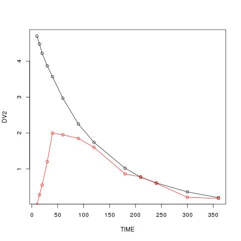
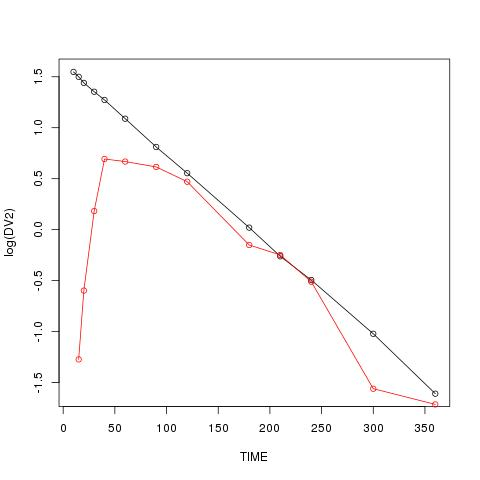

# PK08 - Two-compartment distribution models

이 예제는 Pharmacokinetic and Pharmacodynamic Data Analysis 교과서의 예제입니다.  
소스 코드는 [깃헙](https://github.com/asancpt/edison-gab)에 올라와 있습니다.
에디슨 앱은 <https://www.edison.re.kr/simulation> 에서 확인할 수 있습니다.


```r
dPK08 = read.csv("data-raw/PK08.csv", skip=1)
colnames(dPK08) = c("TIME", "DV") ; dPK08
```

```
##     TIME    DV
## 1   0.05 1.920
## 2   0.10 1.710
## 3   0.25 1.400
## 4   0.40 1.280
## 5   0.50 1.170
## 6   0.70 0.990
## 7   1.00 0.970
## 8   1.30 0.962
## 9   1.60 0.820
## 10  2.00 0.819
## 11  2.50 0.780
## 12  3.00 0.729
## 13  3.50 0.643
## 14  4.00 0.665
## 15  5.00 0.591
## 16  6.00 0.567
## 17  7.00 0.524
## 18 10.00 0.426
## 19 15.00 0.332
## 20 20.00 0.267
## 21 25.00 0.179
## 22 35.00 0.116
## 23 45.00 0.069
```

```r
Div = 100
png('figure1.png', type = 'cairo')
plot(DV ~ TIME, data=dPK08, type="o")
dev.off()
```

```
## png 
##   2
```

```r
png('figure2.png', type = 'cairo')
plot(log(DV) ~ TIME, data=dPK08, type="o")
dev.off()
```

```
## png 
##   2
```

```r
##
fPK08a = function(THETA) # biexponential
{
  A     = THETA[1]
  alpha = THETA[2]
  B     = THETA[3]
  beta  = THETA[4]
  TIME  = e$DATA[,"TIME"]
  Cp = A*exp(-alpha*TIME) + B*exp(-beta*TIME) # eq 8:1
  return(Cp)
}

nlr(fPK08a, dPK08, pNames=c("A", "alpha", "B", "beta"), IE=c(2, 2, 1, 0.1), Error="POIS")
```

```
## $Est
##              A      alpha          B        beta   PoisErrVar    PoisErrSD
## PE  1.09702032  2.2241012 0.85517722 0.060580004 2.332974e-03  0.048300865
## SE  0.06213283  0.2868177 0.02330448 0.002526805 6.889081e-04  0.007131427
## RSE 5.66378097 12.8958944 2.72510509 4.171021296 2.952919e+01 14.764594032
## 
## $Cov
##                        A        alpha             B          beta
## A           3.860488e-03 9.865563e-03 -3.096518e-08 -4.755957e-06
## alpha       9.865563e-03 8.226442e-02  4.401645e-03  3.029052e-04
## B          -3.096518e-08 4.401645e-03  5.430987e-04  4.115985e-05
## beta       -4.755957e-06 3.029052e-04  4.115985e-05  6.384743e-06
## PoisErrVar -4.690200e-08 8.737138e-07 -9.439557e-08  5.318549e-08
##               PoisErrVar
## A          -4.690200e-08
## alpha       8.737138e-07
## B          -9.439557e-08
## beta        5.318549e-08
## PoisErrVar  4.745944e-07
## 
## $run
## $run$m
## [1] 10
## 
## $run$n
## [1] 13
## 
## $run$run
## [1] 7
## 
## $run$p.value
## [1] 0.01702786
## 
## 
## $`Objective Function Value`
## [1] -128.0838
## 
## $`-2LL`
## [1] -85.81262
## 
## $AIC
## [1] -75.81262
## 
## $AICc
## [1] -72.28321
## 
## $BIC
## [1] -70.13515
## 
## $Convergence
## NULL
## 
## $Message
## [1] "CONVERGENCE: REL_REDUCTION_OF_F <= FACTR*EPSMCH"
## 
## $Prediction
##  [1] 1.83415550 1.72827238 1.47144670 1.28536332 1.19045455 1.05091675
##  [7] 0.92356734 0.85129941 0.80741997 0.77042951 0.73921246 0.71445050
## [13] 0.69224400 0.67129751 0.63171252 0.59456596 0.55961499 0.46661695
## [19] 0.34467732 0.25460381 0.18806894 0.10261751 0.05599198
## 
## $Residual
##  [1]  0.085844502 -0.018272377 -0.071446703 -0.005363316 -0.020454547
##  [6] -0.060916748  0.046432655  0.110700587  0.012580033  0.048570494
## [11]  0.040787543  0.014549499 -0.049243995 -0.006297510 -0.040712520
## [16] -0.027565957 -0.035614994 -0.040616949 -0.012677315  0.012396193
## [21] -0.009068944  0.013382491  0.013008017
## 
## $`Elapsed Time`
## Time difference of 0.0270021 secs
```

```r
wnl5(fPK08a, dPK08, pNames=c("A", "alpha", "B", "beta"), IE=c(2, 2, 1, 0.1), Error="POIS")
```

```
## $PE
##          A      alpha          B       beta 
## 1.09725824 2.21980682 0.85563811 0.06031816 
## 
## $WRSS
## [1] 0.0535843
## 
## $run
## $run$m
## [1] 10
## 
## $run$n
## [1] 13
## 
## $run$run
## [1] 7
## 
## $run$p.value
## [1] 0.01702786
## 
## 
## $AIC
## [1] -59.30948
## 
## $SBC
## [1] -54.76751
## 
## $`Condition Number`
## [1] 161.2512
## 
## $Convergence
## NULL
## 
## $Message
## [1] "CONVERGENCE: REL_REDUCTION_OF_F <= FACTR*EPSMCH"
## 
## $Prediction
##  [1] 1.83504987 1.72932055 1.47276822 1.28677335 1.19186431 1.05225533
##  [7] 0.92474855 0.85234878 0.80838593 0.77134837 0.74013660 0.71541375
## [13] 0.69325845 0.67236553 0.63288132 0.59582176 0.56094379 0.46809247
## [19] 0.34622022 0.25607855 0.18940610 0.10361807 0.05668616
## 
## $Residual
##  [1]  0.084950126 -0.019320553 -0.072768217 -0.006773345 -0.021864314
##  [6] -0.062255326  0.045251451  0.109651218  0.011614072  0.047651628
## [11]  0.039863401  0.013586253 -0.050258452 -0.007365529 -0.041881322
## [16] -0.028821756 -0.036943795 -0.042092474 -0.014220219  0.010921453
## [21] -0.010406102  0.012381929  0.012313840
## 
## $`Elapsed Time`
## Time difference of 0.005999804 secs
```

```r
##
fPK08b = function(THETA) # Takada
{
  Vc   = THETA[1]
  beta = THETA[2]
  Vmax = THETA[3]
  Kd   = THETA[4]
  TIME = e$DATA[,"TIME"]
  Vt   = Vmax*TIME/(Kd + TIME)         # eq 8:3
  Cp   = Div/(Vc + Vt)*exp(-beta*TIME) # eq 8:2
  return(Cp)
}  

nlr(fPK08b, dPK08, pNames=c("Vc", "beta", "Vmax", "Kd"), IE=c(100, 0.1, 140, 1.0), Error="POIS")
```

```
## $Est
##            Vc        beta      Vmax          Kd   PoisErrVar    PoisErrSD
## PE  46.894300 0.053980512 90.659489  0.75237686 8.989454e-04  0.029982418
## SE   1.368629 0.001807649  3.421266  0.09452026 2.652349e-04  0.004423173
## RSE  2.918540 3.348707532  3.773754 12.56288744 2.950511e+01 14.752556819
## 
## $Cov
##                       Vc          beta          Vmax            Kd
## Vc          1.873145e+00 -7.323392e-04  6.130021e-01  9.506642e-02
## beta       -7.323392e-04  3.267597e-06 -4.634375e-03 -1.031728e-04
## Vmax        6.130021e-01 -4.634375e-03  1.170506e+01  2.219362e-01
## Kd          9.506642e-02 -1.031728e-04  2.219362e-01  8.934079e-03
## PoisErrVar  2.134815e-07  8.285782e-09  6.092591e-07 -7.050173e-08
##               PoisErrVar
## Vc          2.134815e-07
## beta        8.285782e-09
## Vmax        6.092591e-07
## Kd         -7.050173e-08
## PoisErrVar  7.034953e-08
## 
## $run
## $run$m
## [1] 11
## 
## $run$n
## [1] 12
## 
## $run$run
## [1] 13
## 
## $run$p.value
## [1] 0.4928244
## 
## 
## $`Objective Function Value`
## [1] -149.8922
## 
## $`-2LL`
## [1] -107.621
## 
## $AIC
## [1] -97.621
## 
## $AICc
## [1] -94.09159
## 
## $BIC
## [1] -91.94353
## 
## $Convergence
## NULL
## 
## $Message
## [1] "CONVERGENCE: REL_REDUCTION_OF_F <= FACTR*EPSMCH"
## 
## $Prediction
##  [1] 1.89804675 1.72885437 1.41945104 1.24885381 1.17147583 1.06294936
##  [7] 0.96061625 0.89363401 0.84494901 0.79600104 0.74948359 0.71244747
## [13] 0.68127753 0.65405187 0.60738090 0.56753444 0.53226905 0.44422037
## [19] 0.33401589 0.25302426 0.19225856 0.11144815 0.06475979
## 
## $Residual
##  [1]  0.021953252 -0.018854370 -0.019451035  0.031146192 -0.001475831
##  [6] -0.072949360  0.009383750  0.068365986 -0.024949010  0.022998965
## [11]  0.030516412  0.016552535 -0.038277532  0.010948127 -0.016380901
## [16] -0.000534439 -0.008269045 -0.018220366 -0.002015887  0.013975735
## [21] -0.013258559  0.004551851  0.004240208
## 
## $`Elapsed Time`
## Time difference of 0.02600098 secs
```

```r
wnl5(fPK08b, dPK08, pNames=c("Vc", "beta", "Vmax", "Kd"), IE=c(100, 0.1, 140, 1.0), Error="POIS")
```

```
## $PE
##          Vc        beta        Vmax          Kd 
## 46.89122035  0.05387517 90.65061182  0.75324961 
## 
## $WRSS
## [1] 0.02066403
## 
## $run
## $run$m
## [1] 11
## 
## $run$n
## [1] 12
## 
## $run$run
## [1] 13
## 
## $run$p.value
## [1] 0.4928244
## 
## 
## $AIC
## [1] -81.2253
## 
## $SBC
## [1] -76.68332
## 
## $`Condition Number`
## [1] 3066.409
## 
## $Convergence
## NULL
## 
## $Message
## [1] "CONVERGENCE: REL_REDUCTION_OF_F <= FACTR*EPSMCH"
## 
## $Prediction
##  [1] 1.89840974 1.72932344 1.41999838 1.24938430 1.17198645 1.06342212
##  [7] 0.96104773 0.89404014 0.84534049 0.79638351 0.74986492 0.71283405
## [13] 0.68167291 0.65445799 0.60781089 0.56798852 0.53274570 0.44475017
## [19] 0.33458505 0.25358681 0.19278651 0.11187130 0.06507396
## 
## $Residual
##  [1]  0.0215902577 -0.0193234373 -0.0199983766  0.0306156955 -0.0019864527
##  [6] -0.0734221248  0.0089522742  0.0679598552 -0.0253404910  0.0226164945
## [11]  0.0301350793  0.0161659543 -0.0386729054  0.0105420132 -0.0168108892
## [16] -0.0009885201 -0.0087457016 -0.0187501657 -0.0025850525  0.0134131929
## [21] -0.0137865136  0.0041287044  0.0039260391
## 
## $`Elapsed Time`
## Time difference of 0.006999969 secs
```

```r
##
fPK08c = function(THETA) # Colburn
{
  Vc   = THETA[1]
  beta = THETA[2]
  Vmax = THETA[3]                     # Erratum p 516 initial value : Vt -> Vmax
  Kv   = THETA[4]
  TIME = e$DATA[,"TIME"]
  Vt = Vmax*(1 - exp(-Kv*TIME))        # eq 8:5
  Cp = Div/(Vc + Vt)*exp(-beta*TIME)   # eq 8:4
  return(Cp)
}

nlr(fPK08c, dPK08, pNames=c("Vc", "beta", "Vt", "Kv"), IE=c(100, 0.1, 140, 1.0), Error="POIS")
```

```
## $Est
##            Vc        beta        Vt         Kv   PoisErrVar    PoisErrSD
## PE  49.338320 0.058548700 71.750188  1.2009764 1.555610e-03  0.039441223
## SE   1.551390 0.002195125  3.023266  0.1448428 4.591537e-04  0.005820733
## RSE  3.144392 3.749229202  4.213601 12.0604173 2.951599e+01 14.757993473
## 
## $Cov
##                       Vc          beta            Vt            Kv
## Vc          2.406811e+00 -7.377758e-04 -7.149222e-01 -1.476397e-01
## beta       -7.377758e-04  4.818574e-06 -4.413737e-03  1.702700e-04
## Vt         -7.149222e-01 -4.413737e-03  9.140140e+00 -2.171509e-01
## Kv         -1.476397e-01  1.702700e-04 -2.171509e-01  2.097943e-02
## PoisErrVar  1.317468e-06  2.421028e-08  3.338369e-06  2.391046e-07
##              PoisErrVar
## Vc         1.317468e-06
## beta       2.421028e-08
## Vt         3.338369e-06
## Kv         2.391046e-07
## PoisErrVar 2.108221e-07
## 
## $run
## $run$m
## [1] 11
## 
## $run$n
## [1] 12
## 
## $run$run
## [1] 13
## 
## $run$p.value
## [1] 0.4928244
## 
## 
## $`Objective Function Value`
## [1] -137.3546
## 
## $`-2LL`
## [1] -95.08346
## 
## $AIC
## [1] -85.08346
## 
## $AICc
## [1] -81.55405
## 
## $BIC
## [1] -79.40599
## 
## $Convergence
## NULL
## 
## $Message
## [1] "CONVERGENCE: REL_REDUCTION_OF_F <= FACTR*EPSMCH"
## 
## $Prediction
##  [1] 1.86299774 1.73024124 1.45033663 1.27346872 1.18823611 1.06490400
##  [7] 0.94788256 0.87400576 0.82341094 0.77622974 0.73502371 0.70417892
## [13] 0.67883488 0.65660211 0.61715666 0.58146537 0.54823014 0.45985918
## [19] 0.34315191 0.25606459 0.19107886 0.10639932 0.05924683
## 
## $Residual
##  [1]  0.057002264 -0.020241238 -0.050336628  0.006531285 -0.018236115
##  [6] -0.074903999  0.022117437  0.087994240 -0.003410940  0.042770256
## [11]  0.044976286  0.024821081 -0.035834884  0.008397886 -0.026156661
## [16] -0.014465367 -0.024230139 -0.033859184 -0.011151906  0.010935411
## [21] -0.012078859  0.009600677  0.009753174
## 
## $`Elapsed Time`
## Time difference of 0.02700186 secs
```

```r
wnl5(fPK08c, dPK08, pNames=c("Vc", "beta", "Vt", "Kv"), IE=c(100, 0.1, 140, 1.0), Error="POIS")
```

```
## $PE
##          Vc        beta          Vt          Kv 
## 49.32862304  0.05837012 71.72548263  1.19921635 
## 
## $WRSS
## [1] 0.03574559
## 
## $run
## $run$m
## [1] 11
## 
## $run$n
## [1] 12
## 
## $run$run
## [1] 13
## 
## $run$p.value
## [1] 0.4928244
## 
## 
## $AIC
## [1] -68.62055
## 
## $SBC
## [1] -64.07857
## 
## $`Condition Number`
## [1] 2067.007
## 
## $Convergence
## NULL
## 
## $Message
## [1] "CONVERGENCE: REL_REDUCTION_OF_F <= FACTR*EPSMCH"
## 
## $Prediction
##  [1] 1.86360916 1.73098580 1.45124469 1.27439644 1.18914957 1.06576893
##  [7] 0.94867147 0.87473419 0.82409630 0.77688035 0.73565794 0.70481703
## [13] 0.67948950 0.65728052 0.61789146 0.58225686 0.54907279 0.46081209
## [19] 0.34417013 0.25705382 0.19198839 0.10709687 0.05974184
## 
## $Residual
##  [1]  0.056390843 -0.020985799 -0.051244691  0.005603563 -0.019149566
##  [6] -0.075768932  0.021328530  0.087265809 -0.004096304  0.042119650
## [11]  0.044342064  0.024182968 -0.036489495  0.007719485 -0.026891458
## [16] -0.015256863 -0.025072787 -0.034812092 -0.012170130  0.009946175
## [21] -0.012988391  0.008903133  0.009258164
## 
## $`Elapsed Time`
## Time difference of 0.006000042 secs
```

```r
##
fPK08d = function(THETA) # Reparametrized Cl model
{
  Cl    = THETA[1]
  alpha = THETA[2]
  B     = THETA[3]
  beta  = THETA[4]
  TIME = e$DATA[,"TIME"]
  Cp = alpha*(Div/Cl - B/beta)*exp(-alpha*TIME) + B*exp(-beta*TIME) # eq 8:8
  return(Cp)
}

nlr(fPK08d, dPK08, pNames=c("Cl", "alpha", "B", "beta"), IE=c(10, 2, 1, 0.1), Error="POIS") # fitting failure
```

```
## Warning in log(Ci): NaNs produced

## Warning in log(Ci): NaNs produced

## Warning in log(Ci): NaNs produced

## Warning in log(Ci): NaNs produced

## Warning in log(Ci): NaNs produced

## Warning in log(Ci): NaNs produced

## Warning in log(Ci): NaNs produced

## Warning in log(Ci): NaNs produced

## Warning in log(Ci): NaNs produced

## Warning in log(Ci): NaNs produced

## Warning in log(Ci): NaNs produced
```

```
## Warning in cov2cor(e$Cov): diag(.) had 0 or NA entries; non-finite result
## is doubtful
```

```
## Error in eigen(e$Correl): 'x'에 무한(infinite) 또는 결측(missing)값이 존재합니다.
```

```r
nlr(fPK08d, dPK08, pNames=c("Cl", "alpha", "B", "beta"), IE=c(10, 2, 1, 0.1))
```

```
## $Est
##            Cl     alpha          B        beta    AddErrVar     AddErrSD
## PE  7.5075519  2.677972 0.90744625 0.070296408 1.633436e-03  0.040415789
## SE  0.4243637  0.272048 0.02728071 0.005449996 4.877669e-04  0.006034361
## RSE 5.6524911 10.158731 3.00631671 7.752880352 2.986140e+01 14.930702042
## 
## $Cov
##                     Cl         alpha            B         beta
## Cl        1.800846e-01  3.956238e-02 6.639174e-03 2.213345e-03
## alpha     3.956238e-02  7.401011e-02 5.089273e-03 7.225418e-04
## B         6.639174e-03  5.089273e-03 7.442370e-04 1.168324e-04
## beta      2.213345e-03  7.225418e-04 1.168324e-04 2.970246e-05
## AddErrVar 2.508604e-06 -1.873674e-06 3.007475e-07 4.738679e-08
##               AddErrVar
## Cl         2.508604e-06
## alpha     -1.873674e-06
## B          3.007475e-07
## beta       4.738679e-08
## AddErrVar  2.379166e-07
## 
## $run
## $run$m
## [1] 11
## 
## $run$n
## [1] 12
## 
## $run$run
## [1] 9
## 
## $run$p.value
## [1] 0.09919028
## 
## 
## $`Objective Function Value`
## [1] -124.8533
## 
## $`-2LL`
## [1] -82.5821
## 
## $AIC
## [1] -72.5821
## 
## $AICc
## [1] -69.05269
## 
## $BIC
## [1] -66.90463
## 
## $Convergence
## NULL
## 
## $Message
## [1] "CONVERGENCE: REL_REDUCTION_OF_F <= FACTR*EPSMCH"
## 
## $Prediction
##  [1] 1.86712558 1.74328561 1.45522232 1.25942732 1.16464233 1.03276087
##  [7] 0.92147537 0.86206248 0.82607842 0.79362422 0.76255975 0.73526482
## [13] 0.70961940 0.68504499 0.63852124 0.59517536 0.55477326 0.44929076
## [19] 0.31614097 0.22245085 0.15652632 0.07749862 0.03837077
## 
## $Residual
##  [1]  0.052874422 -0.033285606 -0.055222324  0.020572684  0.005357674
##  [6] -0.042760869  0.048524628  0.099937520 -0.006078418  0.025375781
## [11]  0.017440246 -0.006264817 -0.066619402 -0.020044985 -0.047521239
## [16] -0.028175361 -0.030773265 -0.023290765  0.015859030  0.044549149
## [21]  0.022473685  0.038501385  0.030629229
## 
## $`Elapsed Time`
## Time difference of 0.03800201 secs
```

```r
wnl5(fPK08d, dPK08, pNames=c("Cl", "alpha", "B", "beta"), IE=c(10, 2, 1, 0.1), Error="POIS")
```

```
## Warning in sqrt(Fi[Fi != 0]): NaNs produced
```

```
## Warning in sqrt(Fi[Fi != 0]): NaNs produced

## Warning in sqrt(Fi[Fi != 0]): NaNs produced

## Warning in sqrt(Fi[Fi != 0]): NaNs produced

## Warning in sqrt(Fi[Fi != 0]): NaNs produced

## Warning in sqrt(Fi[Fi != 0]): NaNs produced

## Warning in sqrt(Fi[Fi != 0]): NaNs produced

## Warning in sqrt(Fi[Fi != 0]): NaNs produced
```

```
## Error in eigen(e$Hess): 'x'에 무한(infinite) 또는 결측(missing)값이 존재합니다.
```

```r
##
require(deSolve)
PK2c = function(t, y, p)
{
  dy1dt = (-p["Cl"]*y[1] - p["Cld"]*y[1] + p["Cld"]*y[2])/p["Vc"]   # Eq 8:9
  dy2dt = (p["Cld"]*y[1] - p["Cld"]*y[2])/p["Vt"]                   # Eq 8:10
  return(list(c(dy1dt, dy2dt)))
}

Times = c(0, dPK08[,"TIME"])
iTime = 2:length(Times)
lsoda(y=c(Div/50, 0), times=Times, func=PK2c, parms=c(Vc=50, Cl=7, Cld=50, Vt=60))
```

```
##     time          1          2
## 1   0.00 2.00000000 0.00000000
## 2   0.05 1.89116750 0.07934952
## 3   0.10 1.79203478 0.15122198
## 4   0.25 1.54439229 0.32849733
## 5   0.40 1.35669102 0.45960592
## 6   0.50 1.25731764 0.52718614
## 7   0.70 1.10511099 0.62656940
## 8   1.00 0.95718146 0.71397674
## 9   1.30 0.86776559 0.75667930
## 10  1.60 0.81142840 0.77431233
## 11  2.00 0.76395638 0.77720124
## 12  2.50 0.72610586 0.76535820
## 13  3.00 0.69856476 0.74678700
## 14  3.50 0.67537629 0.72605113
## 15  4.00 0.65423971 0.70489155
## 16  5.00 0.61507879 0.66351333
## 17  6.00 0.57861076 0.62429427
## 18  7.00 0.54435603 0.58735247
## 19 10.00 0.45331028 0.48911830
## 20 15.00 0.33413219 0.36052605
## 21 20.00 0.24628830 0.26574357
## 22 25.00 0.18153828 0.19587820
## 23 35.00 0.09863167 0.10642316
## 24 45.00 0.05358744 0.05782092
```

```r
fPK08e = function(THETA)
{
  Fs = lsoda(y=c(Div/THETA[1],0), times=Times, func=PK2c, parms=c(Vc=THETA[1], Cl=THETA[2], Cld=THETA[3], Vt=THETA[4]))
  return(Fs[iTime,2])
}

nlr(fPK08e, dPK08, pNames=c("Vc", "Cl", "Cld", "Vt"), IE=c(50, 7, 50, 60), Error="POIS")
```

```
## $Est
##            Vc        Cl       Cld        Vt   PoisErrVar    PoisErrSD
## PE  51.231232 6.8448182 58.507756 58.045231 2.333790e-03  0.048309320
## SE   1.734093 0.1991523  6.972165  2.528373 6.894091e-04  0.007135363
## RSE  3.384836 2.9095337 11.916652  4.355867 2.954032e+01 14.770158926
## 
## $Cov
##                       Vc            Cl           Cld            Vt
## Vc          3.007080e+00 -1.243984e-02 -8.852313e+00 -1.747818e+00
## Cl         -1.243984e-02  3.966163e-02  8.308616e-02 -1.046641e-01
## Cld        -8.852313e+00  8.308616e-02  4.861109e+01  2.203379e+00
## Vt         -1.747818e+00 -1.046641e-01  2.203379e+00  6.392670e+00
## PoisErrVar  4.721883e-06  6.647825e-06  2.235211e-05  3.455387e-06
##              PoisErrVar
## Vc         4.721883e-06
## Cl         6.647825e-06
## Cld        2.235211e-05
## Vt         3.455387e-06
## PoisErrVar 4.752849e-07
## 
## $run
## $run$m
## [1] 10
## 
## $run$n
## [1] 13
## 
## $run$run
## [1] 7
## 
## $run$p.value
## [1] 0.01702786
## 
## 
## $`Objective Function Value`
## [1] -128.0844
## 
## $`-2LL`
## [1] -85.8132
## 
## $AIC
## [1] -75.8132
## 
## $AICc
## [1] -72.28379
## 
## $BIC
## [1] -70.13573
## 
## $Convergence
## NULL
## 
## $Message
## [1] "CONVERGENCE: REL_REDUCTION_OF_F <= FACTR*EPSMCH"
## 
## $Prediction
##  [1] 1.83397201 1.72815387 1.47145812 1.28543786 1.19055302 1.05102371
##  [7] 0.92365317 0.85135610 0.80745208 0.77043987 0.73920889 0.71444081
## [13] 0.69223213 0.67128502 0.63170003 0.59455393 0.55960312 0.46660577
## [19] 0.34467185 0.25459966 0.18806581 0.10261632 0.05599185
## 
## $Residual
##  [1]  0.086027993 -0.018153873 -0.071458120 -0.005437858 -0.020553019
##  [6] -0.061023706  0.046346831  0.110643902  0.012547919  0.048560133
## [11]  0.040791109  0.014559194 -0.049232133 -0.006285016 -0.040700028
## [16] -0.027553928 -0.035603120 -0.040605772 -0.012671853  0.012400342
## [21] -0.009065814  0.013383677  0.013008150
## 
## $`Elapsed Time`
## Time difference of 2.117121 secs
```

```r
wnl5(fPK08e, dPK08, pNames=c("Vc", "Cl", "Cld", "Vt"), IE=c(50, 7, 50, 60), Error="POIS")
```

```
## $PE
##       Vc       Cl      Cld       Vt 
## 51.20503  6.81188 58.41076 58.03289 
## 
## $WRSS
## [1] 0.05358264
## 
## $run
## $run$m
## [1] 10
## 
## $run$n
## [1] 13
## 
## $run$run
## [1] 7
## 
## $run$p.value
## [1] 0.01702786
## 
## 
## $AIC
## [1] -59.31019
## 
## $SBC
## [1] -54.76822
## 
## $`Condition Number`
## [1] 36.55808
## 
## $Convergence
## NULL
## 
## $Message
## [1] "ERROR: ABNORMAL_TERMINATION_IN_LNSRCH"
## 
## $Prediction
##  [1] 1.83507665 1.72933817 1.47276614 1.28675983 1.19185110 1.05223943
##  [7] 0.92473494 0.85233933 0.80837997 0.77134588 0.74013682 0.71541532
## [13] 0.69326114 0.67236908 0.63288607 0.59582755 0.56095016 0.46810001
## [19] 0.34623277 0.25609111 0.18941691 0.10362759 0.05669364
## 
## $Residual
##  [1]  0.084923346 -0.019338171 -0.072766141 -0.006759831 -0.021851100
##  [6] -0.062239431  0.045265056  0.109660671  0.011620029  0.047654123
## [11]  0.039863182  0.013584678 -0.050261145 -0.007369081 -0.041886068
## [16] -0.028827554 -0.036950164 -0.042100009 -0.014232775  0.010908893
## [21] -0.010416912  0.012372407  0.012306355
## 
## $`Elapsed Time`
## Time difference of 1.873107 secs
```

```r
######## multiple dosing########
```

## Figures




