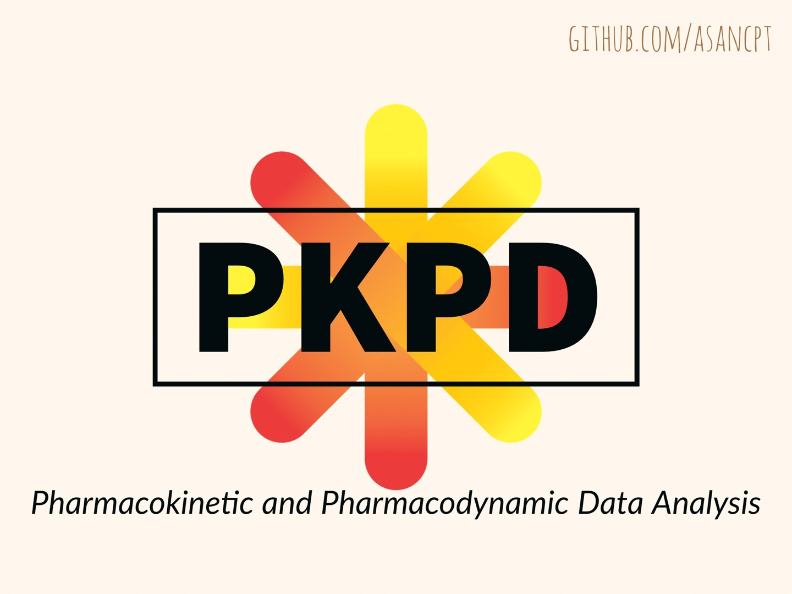

# Edison을 통한 비선형 약동학 회귀 분석과 simulation

이 예제는 Pharmacokinetic and Pharmacodynamic Data Analysis 교과서의 예제입니다.  
소스 코드는 [깃헙](https://github.com/asancpt/edison-gab)에 올라와 있습니다.  
에디슨 앱은 <https://www.edison.re.kr/simulation> 에서 확인할 수 있습니다.  

- PK02 - One-compartment oral dosing
- PK08 - Two-compartment distribution models
- PK09 - Modeling of fraction absorbed and nonlinear bioavailability across the liver

wnl 패키지를 사용하였습니다. 열심히 개발하도록 하겠습니다.

**Disclaimer: All the data is generated by the authors. No copyrighted materials are used.**

